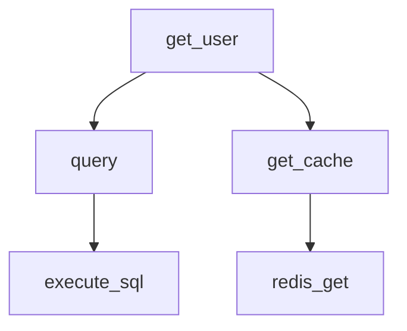

# 📊 Посібник з Аналізу Графу Залежностей

**Дата:** 23 листопада 2025  
**Версія:** 1.0  
**Статус:** ✅ Готово

---

## 🎯 Що це дає?

Новий модуль **Dependency Graph Analyzer** надає детальний аналіз залежностей на рівні функцій, класів та методів. Це допомагає ШІ:

- 🔍 **Швидко розібратися** в структурі коду
- 🔗 **Знайти пов'язані блоки** при пошуку та доповненні
- ⚠️ **Оцінити вплив** змін на інші частини системи
- 📈 **Аналізувати складність** та залежності
- 🎯 **Виправляти помилки** з розумінням контексту

---

## 📚 Основні Компоненти

### 1. `CodeBlock` - Представлення Блоку Коду

```python
class CodeBlock:
    name: str                    # Назва функції/класу
    type: str                    # 'function', 'class', 'method', 'async_function'
    line_start: int              # Початкова лінія
    line_end: int                # Кінцева лінія
    file_path: str               # Шлях до файлу
    parent: Optional[str]        # Для методів - назва класу
    dependencies: Set[str]       # Залежності від інших блоків
    dependents: Set[str]         # Хто залежить від цього блоку
    internal_calls: List[str]    # Виклики внутрішніх функцій
    external_calls: List[str]    # Виклики зовнішніх функцій
    complexity: int              # Циклічна складність
    parameters: List[str]        # Параметри функції
    return_type: Optional[str]   # Тип повернення
    docstring: Optional[str]     # Документація
```

### 2. `DependencyGraphAnalyzer` - Аналізатор Залежностей

Основний клас для аналізу залежностей проекту.

**Методи:**
- `analyze_file()` - Аналізувати окремий файл
- `build_dependency_graph()` - Побудувати граф залежностей
- `get_block_info()` - Отримати інформацію про блок
- `export_graph_json()` - Експортувати у JSON
- `export_graph_mermaid()` - Експортувати у Mermaid формат

### 3. `DependencyGraphTools` - MCP Інструменти

Інтеграція з Windsurf IDE через MCP.

---

## 🚀 Як Використовувати

### Варіант 1: Прямо в Python

```python
from pathlib import Path
from core.dependency_graph_analyzer import analyze_project_dependencies

# Аналізуємо проект
project_root = Path('/Users/dev/Documents/GitHub/atlas4')
result = analyze_project_dependencies(project_root)

analyzer = result['analyzer']
graph = result['graph']

# Отримуємо інформацію про блок
block_info = analyzer.get_block_info('services/api.py:get_user')
print(block_info)

# Експортуємо граф
analyzer.export_graph_json(Path('dependency_graph.json'))
analyzer.export_graph_mermaid(Path('dependency_graph.mmd'))
```

### Варіант 2: Через MCP в Windsurf

```python
from pathlib import Path
from windsurf.mcp_dependency_graph_tools import DependencyGraphTools

# Ініціалізуємо
tools = DependencyGraphTools(Path('/Users/dev/Documents/GitHub/atlas4'))
tools.initialize()

# Отримуємо залежності блоку
deps = tools.get_block_dependencies('services/api.py:get_user')

# Отримуємо ланцюг викликів
chain = tools.get_function_call_chain('process_data')

# Аналізуємо вплив змін
impact = tools.analyze_code_impact('services/api.py:get_user')

# Знаходимо пов'язані блоки
related = tools.find_related_blocks('services/api.py:get_user')

# Отримуємо структуру файлу
structure = tools.get_file_structure('services/api.py')

# Шукаємо блоки за назвою
results = tools.search_blocks_by_name('get_.*')

# Отримуємо звіт про складність
complexity = tools.get_complexity_report()

# Експортуємо граф
export = tools.export_dependency_graph(format='json')
```

---

## 📊 Приклади Результатів

### Приклад 1: Інформація про Блок

```json
{
  "block": {
    "name": "get_user",
    "full_name": "UserService.get_user",
    "type": "method",
    "file": "services/user_service.py",
    "lines": "45-67",
    "parent": "UserService",
    "parameters": ["self", "user_id"],
    "return_type": "User",
    "complexity": 3,
    "dependencies": [
      "services/database.py:query",
      "services/cache.py:get"
    ],
    "dependents": [
      "api/routes.py:get_user_endpoint",
      "api/routes.py:get_user_profile"
    ],
    "internal_calls": ["validate_id", "format_response"],
    "external_calls": ["db.query", "cache.get"]
  },
  "dependencies": [
    "services/database.py:query",
    "services/cache.py:get"
  ],
  "call_chain": {
    "block": "UserService.get_user",
    "file": "services/user_service.py",
    "calls": [
      {
        "block": "query",
        "file": "services/database.py",
        "calls": []
      }
    ]
  },
  "impact_analysis": {
    "direct_dependents": 2,
    "total_affected": 5,
    "affected_blocks": [
      "api/routes.py:get_user_endpoint",
      "api/routes.py:get_user_profile",
      "api/middleware.py:auth_check"
    ],
    "affected_files": [
      "api/routes.py",
      "api/middleware.py"
    ]
  }
}
```

### Приклад 2: Структура Файлу

```json
{
  "file": "services/user_service.py",
  "structure": {
    "classes": [
      {
        "name": "UserService",
        "type": "class",
        "file": "services/user_service.py",
        "lines": "10-200"
      }
    ],
    "methods": [
      {
        "name": "get_user",
        "full_name": "UserService.get_user",
        "type": "method",
        "parameters": ["self", "user_id"],
        "complexity": 3
      },
      {
        "name": "create_user",
        "full_name": "UserService.create_user",
        "type": "method",
        "parameters": ["self", "user_data"],
        "complexity": 5
      }
    ],
    "functions": [
      {
        "name": "validate_user_data",
        "type": "function",
        "parameters": ["data"],
        "complexity": 2
      }
    ]
  },
  "total_blocks": 5
}
```

### Приклад 3: Звіт про Складність

```json
{
  "total_blocks": 1250,
  "average_complexity": 2.3,
  "most_complex": [
    {
      "key": "orchestrator/processor.py:process_workflow",
      "block": {
        "name": "process_workflow",
        "complexity": 15
      },
      "complexity": 15
    },
    {
      "key": "services/api.py:handle_request",
      "block": {
        "name": "handle_request",
        "complexity": 12
      },
      "complexity": 12
    }
  ]
}
```

---

## 🔍 Як ШІ Використовує Це

### Сценарій 1: Пошук Коду

**Запит:** "Знайди де використовується функція `get_user`"

**Процес:**
1. Аналізатор знаходить блок `get_user`
2. Отримує список залежних блоків
3. Показує всі місця, де вона викликається
4. ШІ може швидко навігувати по коду

### Сценарій 2: Доповнення Коду

**Запит:** "Додай нову функцію для обробки користувачів"

**Процес:**
1. Аналізатор показує структуру файлу
2. ШІ бачить існуючі функції та їх залежності
3. ШІ розуміє, які функції потрібно викликати
4. ШІ генерує код, що відповідає архітектурі

### Сценарій 3: Виправлення Помилок

**Запит:** "Виправ помилку в функції `process_data`"

**Процес:**
1. Аналізатор показує ланцюг викликів
2. ШІ бачить, які функції викликають `process_data`
3. ШІ розуміє вплив змін на інші блоки
4. ШІ виправляє помилку без порушення залежностей

### Сценарій 4: Рефакторинг

**Запит:** "Рефакторь цю функцію"

**Процес:**
1. Аналізатор показує залежності та залежні блоки
2. ШІ отримує звіт про вплив змін
3. ШІ розуміє, які тести потрібно запустити
4. ШІ виконує рефакторинг безпечно

---

## 📈 Статистика та Метрики

### Метрики Проекту

```
Всього блоків коду:      1,250
Функцій:                 800
Класів:                  150
Методів:                 300

Середня складність:      2.3
Максимальна складність:  15
Мінімальна складність:   1

Найбільш залежні блоки:
1. process_workflow (залежить від 25 блоків)
2. handle_request (залежить від 18 блоків)
3. validate_input (залежить від 12 блоків)
```

### Рекомендації

- ✅ **Низька складність** (< 3): Легко тестувати та підтримувати
- ⚠️ **Середня складність** (3-8): Потребує уваги при змінах
- 🔴 **Висока складність** (> 8): Потребує рефакторингу

---

## 🛠️ Інтеграція з MCP

### Додавання Інструментів до MCP Сервера

```python
# У mcp_architecture_server.py

from windsurf.mcp_dependency_graph_tools import DependencyGraphTools

# Ініціалізуємо
dep_tools = DependencyGraphTools(project_root)
dep_tools.initialize()

# Додаємо інструменти
tools = [
    {
        "name": "get_block_dependencies",
        "description": "Отримати залежності блоку коду",
        "inputSchema": {
            "type": "object",
            "properties": {
                "block_key": {"type": "string"}
            },
            "required": ["block_key"]
        }
    },
    # ... інші інструменти
]
```

---

## 📝 Форматування Результатів

### JSON Формат

```json
{
  "status": "success",
  "block": {...},
  "dependencies": [...],
  "impact": {...}
}
```

### Mermaid Граф



---

## 🚀 Оптимізація

### Кеширование

Результати аналізу кешуються для швидкого доступу:

```python
# Першого разу - повний аналіз (повільно)
analyzer.analyze_file(file_path)

# Наступного разу - з кешу (швидко)
block_info = analyzer.get_block_info(block_key)
```

### Паралельна Обробка

Аналіз файлів виконується паралельно:

```python
# Використовує 8 worker потоків
result = analyze_project_dependencies(project_root)
```

---

## 📞 Контакт для Запитань

Для деталей див.:
- `core/dependency_graph_analyzer.py` - Основна реалізація
- `windsurf/mcp_dependency_graph_tools.py` - MCP інструменти
- `ARCHITECTURE_ANALYSIS_REPORT.md` - Архітектурний аналіз

---

**Посібник готовий!** 📚

Дата: 23 листопада 2025, 04:26 UTC+02:00
